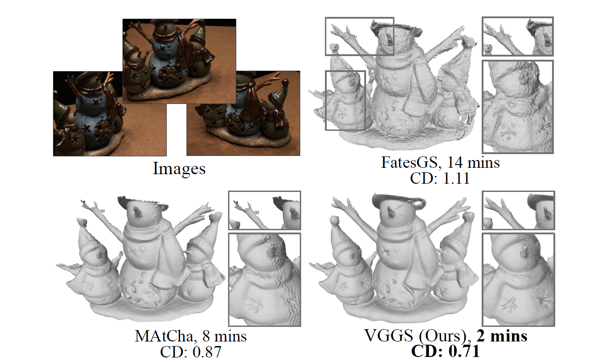

# VGGS: VGGT-guided Gaussian Splatting for Efficient and Faithful Sparse-View Surface Reconstruction
[Peng Xiang](https://scholar.google.com/citations?user=Bp-ceOAAAAAJ&hl=zh-CN&oi=sra), Liang Han, [Hui Zhang](https://www.thss.tsinghua.edu.cn/en/faculty/huizhang.htm), [Yu-Shen Liu](http://cgcad.thss.tsinghua.edu.cn/liuyushen/), [Zhizhong Han](https://h312h.github.io/)


[](assets/teaser.png)

## [VGGS]

> Reconstructing a faithful geometric surface from sparse images remains a fundamental challenge in 3D computer vision. While recent methods have achieved remarkable progress, they still struggle to recover reliable geometry due to the lack of multi-view geometric cues, particularly in non-overlapping regions. To address this issue, we introduce VGGS, a Gaussian Splatting (GS) method that exploits multi-view geometric priors from VGGT for efficient and high-fidelity sparse-view surface reconstruction. Our primary contribution is an anchor-calibrated depth estimation scheme, which yields accurate depth maps. The insight is to align the VGGT depth prior to the underlying surface with a sparse set of multi-view consistent anchors, then infer depth for unreliable regions by relative depth estimation. Furthermore, to mitigate misalignment in complex scenes, we propose a relative depth consistency loss that penalizes the rendered depth if its relative depth relationship in local regions is inconsistent to the multi-view prior. Extensive experiments on widely-used benchmarks show that VGGS surpasses state-of-the-art methods in both accuracy and efficiency, delivering 4–7× faster optimization while reducing memory consumption compared to previous GS-based approaches.

## Installation
```shell
# SSH
git clone https://github.com/AllenXiangX/VGGS.git
cd VGGS

conda create -n vggs python=3.8
conda activate vggs

pip install torch torchvision torchaudio --index-url https://download.pytorch.org/whl/cu118 #replace your cuda version
pip install -r requirements.txt
pip install submodules/diff-plane-rasterization
pip install submodules/simple-knn
```

## Dataset
Please download the preprocessed [DTU dataset and TNT dataset](https://drive.google.com/drive/folders/1x62cuv46E-elH-zeIQrj9NFMlpw1Vf04?usp=drive_link). The DTU ground truth (dtu_eval) can be downloaded from [DTU dataset](https://roboimagedata.compute.dtu.dk/?page_id=36)


The data folder should like this:
```shell
data
├── DTU
│   ├── set_22_25_28
│   │   ├── scan24
│   │   │   ├── images
│   │   │   ├── mask
│   │   │   ├── dense
│   │   │   │   │── sparse
│   │   │   │   │── depth_vggt
│   │   │   │   │── images
│   │   │   │   │── normal
│   │   │   └── cameras.npz
│   │   └── ...
│   ├── dtu_eval
│   │   ├── Points
│   │   │   └── stl
│   │   └── ObsMask
├── tnt_dataset
│   ├── tnt_10views
│   │   ├── Ignatius
│   │   │   ├── images
│   │   │   ├── depth_vggt
│   │   │   ├── sparse
│   │   │   ├── normal
│   │   │   ├── cameras.json
│   │   │   ├── Ignatius_COLMAP_SfM.log
│   │   │   ├── Ignatius_trans.txt
│   │   │   ├── Ignatius.json
│   │   │   └── Ignatius.ply
│   │   └── ...
```
## Training and Evaluation
```shell
# Fill in the relevant parameters in the script, then run it.

# DTU dataset
python scripts/run_dtu.py

# Tanks and Temples dataset
python scripts/run_tnt.py
```

## [Cite this work]

```
@inproceedings{xiang2026vggs,
  title={VGGS: VGGT-guided Gaussian Splatting for Efficient and Faithful Sparse-View Surface Reconstruction},
  author={Xiang, Peng and Han, Liang and Zhang, Hui and Liu, Yu-Shen and Han, Zhizhong},
  booktitle={Proceedings of the AAAI Conference on Artificial Intelligence},
  volume={40},
  number={13},
  pages={10969--10977},
  year={2026}
}

```

## Acknowledgements

This work is built upon: 
- [PGSR](https://github.com/zju3dv/PGSR)


We thank the authors for their great job!

## License

This project is open sourced under MIT license.